<a id="readme-top"></a>

<div align="center">

<a href="#-quick-start">
  
</a>

<h1>OBD2 K-Line Reader</h1>

<p><b>Open-source car diagnostic tool for ESP32, ESP8266 &amp; Arduino.</b><br>
Read live sensor data, read &amp; clear trouble codes (DTCs), freeze-frame data and VIN from any <b>K-Line</b> vehicle<br>
over <b>ISO 9141-2</b> and <b>KWP2000 (ISO 14230)</b>, straight from a web dashboard in your phone's browser.</p>

<p>
  <a href="https://github.com/muki01/OBD2_K-line_Reader/stargazers"></a>
  <a href="https://github.com/muki01/OBD2_K-line_Reader/network/members"></a>
  <a href="https://github.com/muki01/OBD2_K-line_Reader/issues"></a>
  <a href="LICENSE"></a>
  <a href="https://github.com/muki01/OBD2_K-line_Reader/commits/main"></a>
</p>

<p>
  <a href="#default-pins"></a>
  <a href="#default-pins"></a>
  <a href="#default-pins"></a>
  <a href="#default-pins"></a>
  <a href="#default-pins"></a>
  <a href="#-supported-protocols"></a>
  <a href="#-supported-protocols"></a>
  <a href="https://pcbway.com/g/SD5aQu"></a>
</p>

**[Features](#-features)** · **[Demo](#-see-it-in-action)** · **[Screenshots](#-web-dashboard-screenshots)** · **[How It Works](#-how-it-works)** · **[Hardware](#-hardware)** · **[Quick Start](#-quick-start)** · **[FAQ](#-faq)** · **[Custom Development](#-custom-development)**

</div>

---

## 📖 About

**OBD2 K-Line Reader** is complete, ready-to-flash firmware that turns a cheap microcontroller into a **DIY OBD-II scan tool** for vehicles that use the **K-Line** diagnostic bus. That covers most European and Asian cars built between roughly **2000 and 2010**, before CAN became mandatory.

Plug it into the car's OBD-II port and you get **real-time engine data**, **diagnostic trouble codes** (read and clear), **freeze-frame snapshots**, **VIN and ECU calibration IDs**, a **0–100 km/h acceleration timer** and **battery voltage**, all without an ELM327 adapter, PC software or a paid app.

It comes in two builds:

| Build | Best for | Output | Boards |
|---|---|---|---|
| 🌐 **[`WebServer_Code`](WebServer_Code/README.md)** | A standalone WiFi scan tool | Mobile-friendly web dashboard (WebSocket), OTA updates | ESP32 (incl. S3 / C3 / C6), ESP8266 |
| 🖥️ **[`Basic_Code`](Basic_Code/README.md)** | Quick tests, learning, porting | Serial Monitor | Arduino Uno / Nano / Pro Mini, ESP32 |

The project also includes **six interface schematics**, from a two-transistor circuit to dedicated automotive transceivers (L9637D, MC33290, Si9241, SN65HVDA195), so you can build the hardware for a few dollars.

> [!TIP]
> If this project saves you a trip to the mechanic or helps you learn how cars talk, **please give it a ⭐**. It helps other makers find it.

## 🎬 See It in Action

<table>
<tr>
<td width="45%" align="center">
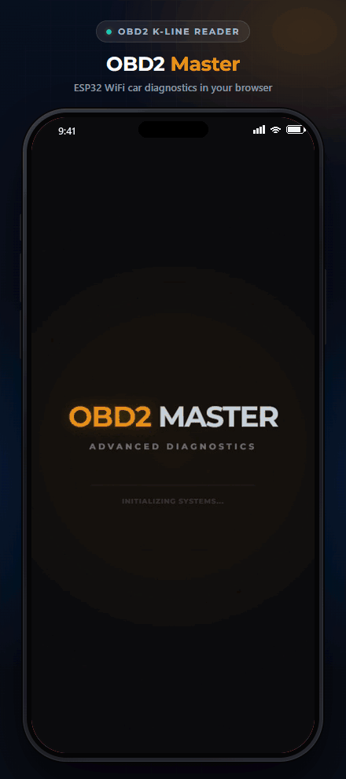
</td>
<td width="55%">

### A full scan tool in your pocket

The ESP32 hosts its own WiFi network. Connect your phone, open **`192.168.4.1`**, and every diagnostic function is one tap away:

- 📊 **Live Data**: real-time PIDs streamed over WebSocket
- ⚠️ **Trouble Codes**: read and clear DTCs, with ~1,000 built-in descriptions
- ❄️ **Freeze Frame**: the sensor snapshot taken when the fault was logged
- 🏁 **0–100 km/h Test**: starts and stops on its own, driven by the vehicle speed PID
- 🚗 **Vehicle Info**: VIN, calibration ID and supported PID maps
- ⚙️ **Settings**: protocol, PID picker, WiFi and OTA firmware update
- 🌙 **Dark Mode**, remembered on each device

No app to install and no cloud. Works on Android, iOS and desktop browsers.

</td>
</tr>
</table>

## ✨ Features

<table>
<tr>
<td valign="top" width="33%">

#### 🩺 Diagnostics
- Live sensor data (**OBD-II Mode 01**)
- Freeze-frame data (**Mode 02**)
- Stored DTCs (**Mode 03**)
- Clear DTCs / reset MIL (**Mode 04**)
- Pending DTCs (**Mode 07**)
- VIN and calibration IDs (**Mode 09**)
- ~1,000 DTC descriptions (P, C, B, U)
- Battery voltage monitor

</td>
<td valign="top" width="33%">

#### 📡 Protocols
- **ISO 9141-2** (5-baud init)
- **ISO 14230-4 KWP2000** slow init
- **ISO 14230-4 KWP2000** fast init
- **Automatic protocol detection**
- Protocol switchable at runtime
- Auto-reconnect when the link drops
- Correct 10.4 kbaud timing, echo cancellation and checksums

</td>
<td valign="top" width="33%">

#### 🛠️ Platform
- ESP32 / S3 / C3 / C6, ESP8266
- Arduino Uno, Nano, Pro Mini
- Portable to STM32 and RP2040
- WiFi **Access Point or Station** mode
- **OTA firmware updates** (ESP32)
- Settings stored in SPIFFS
- Buzzer and LED status feedback
- Six hardware interface options

</td>
</tr>
</table>

## 📱 Web Dashboard Screenshots

<div align="center">
<sub>Screenshots switch between light and dark to match your GitHub theme.</sub>
</div>

<table>
<tr>
<td align="center" width="25%">
<picture><source media="(prefers-color-scheme: dark)" srcset="images/screenshots/dark/main-menu.png">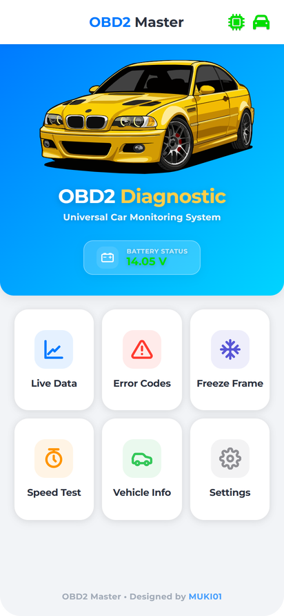</picture>
<br><b>Main Menu</b><br><sub>Battery voltage and quick access</sub>
</td>
<td align="center" width="25%">
<picture><source media="(prefers-color-scheme: dark)" srcset="images/screenshots/dark/live-data.png">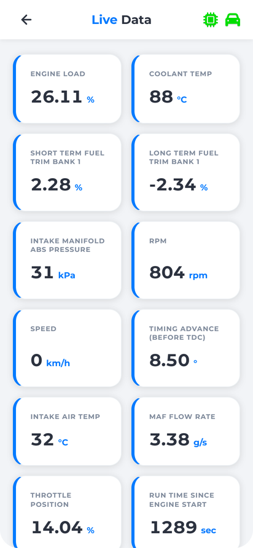</picture>
<br><b>Live Data</b><br><sub>Real-time sensor PIDs</sub>
</td>
<td align="center" width="25%">
<picture><source media="(prefers-color-scheme: dark)" srcset="images/screenshots/dark/error-codes.png">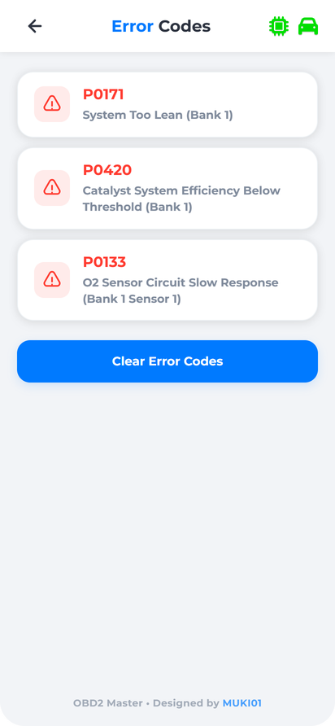</picture>
<br><b>Trouble Codes</b><br><sub>Read and clear DTCs</sub>
</td>
<td align="center" width="25%">
<picture><source media="(prefers-color-scheme: dark)" srcset="images/screenshots/dark/freeze-frame.png">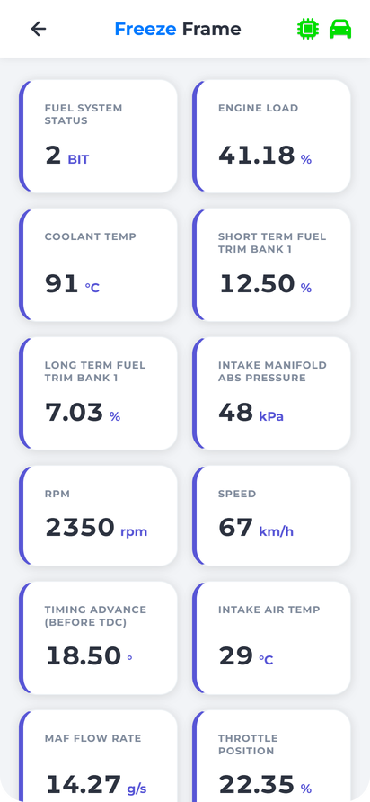</picture>
<br><b>Freeze Frame</b><br><sub>Snapshot at fault time</sub>
</td>
</tr>
<tr>
<td align="center">
<picture><source media="(prefers-color-scheme: dark)" srcset="images/screenshots/dark/speed-test.png">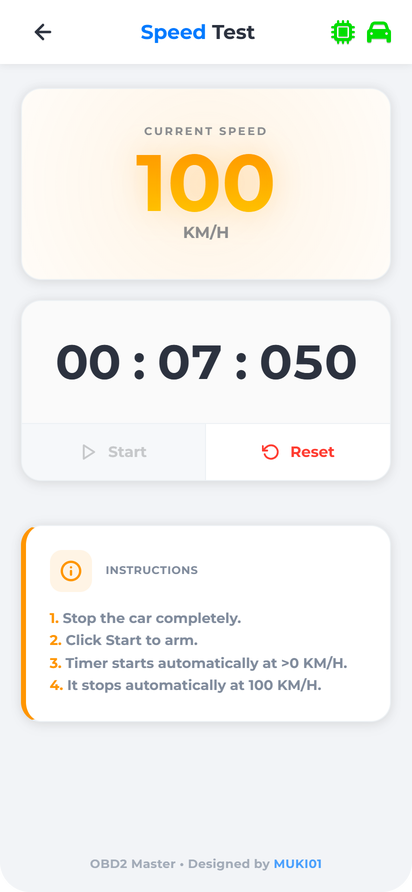</picture>
<br><b>0–100 km/h Test</b><br><sub>Automatic acceleration timer</sub>
</td>
<td align="center">
<picture><source media="(prefers-color-scheme: dark)" srcset="images/screenshots/dark/vehicle-info.png">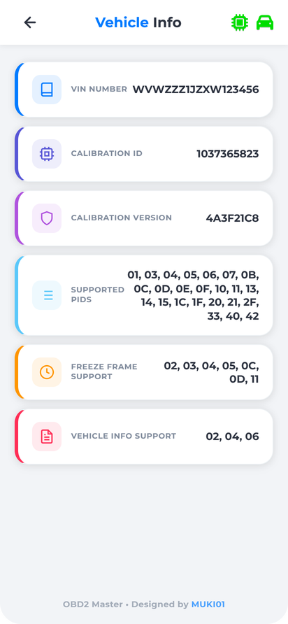</picture>
<br><b>Vehicle Info</b><br><sub>VIN, CAL ID, supported PIDs</sub>
</td>
<td align="center">
<picture><source media="(prefers-color-scheme: dark)" srcset="images/screenshots/dark/settings.png">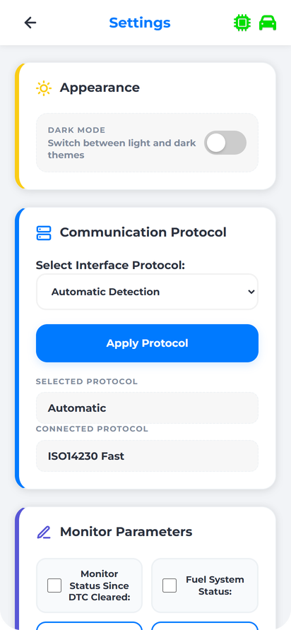</picture>
<br><b>Settings</b><br><sub>Protocol, PIDs, WiFi, OTA</sub>
</td>
<td align="center">
<picture><source media="(prefers-color-scheme: dark)" srcset="images/screenshots/dark/splash-screen.png">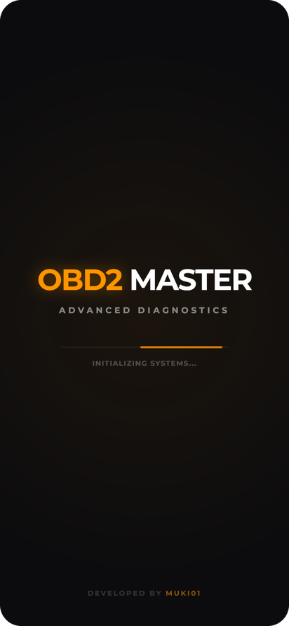</picture>
<br><b>Splash Screen</b><br><sub>Branded boot animation</sub>
</td>
</tr>
</table>

> [!NOTE]
> The dashboard front-end is developed in its own repository: **[OBD2 Diagnostic UI](https://github.com/muki01/OBD2-Diagnostic-UI)**. A pre-built, gzipped copy ships in [`WebServer_Code/data`](WebServer_Code/data).

## 🧭 How It Works

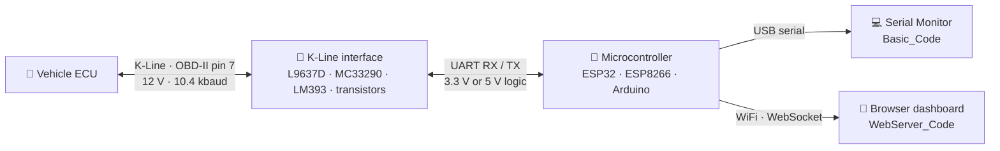

1. **Wake-up.** The firmware wakes the ECU with a **5-baud init** (address `0x33`) or a **fast init** (25 ms low / 25 ms high pulse followed by `StartCommunication`: `C1 33 F1 81 66`).
2. **Detect.** In `Automatic` mode it tries ISO 9141-2, then KWP2000 slow and fast init, and remembers whichever protocol the ECU answers on.
3. **Request.** Standard OBD-II service requests (Modes 01, 02, 03, 04, 07 and 09) are framed with the right header (`68 6A F1` for ISO 9141 or `Cx 33 F1` for KWP2000) plus a checksum.
4. **Decode.** Responses are validated, the K-Line echo is removed, and the values are converted to engineering units using the SAE J1979 formulas.
5. **Publish.** Values go to the Serial Monitor, or to the web dashboard as JSON over a WebSocket about every 100 ms.

### 📡 Supported Protocols

| Protocol | Standard | Initialization | Header | Status |
|---|---|---|---|:---:|
| ISO 9141-2 | ISO 9141-2 | 5-baud slow init | `68 6A F1` | ✅ Tested |
| KWP2000 (slow init) | ISO 14230-4 | 5-baud slow init | `Cx 33 F1` | ✅ Tested |
| KWP2000 (fast init) | ISO 14230-4 | 25 ms wake-up pattern | `Cx 33 F1` | ✅ Tested |
| Auto-detect | none | Tries all of the above | none | ✅ Default |

> [!IMPORTANT]
> **Does my car use K-Line?** Look at your OBD-II socket. If **pin 7** has a metal contact, the car very likely speaks ISO 9141-2 or KWP2000. Cars that only have pins 6 and 14 use **CAN (ISO 15765-4)**; for those, see **[OBD2 CAN Bus Reader](https://github.com/muki01/OBD2_CAN_Bus_Reader)**.

## 🔧 Hardware

### What you need

| Part | Notes |
|---|---|
| Microcontroller | ESP32 / ESP32-S3 / C3 / C6 or ESP8266 for the web dashboard; Arduino Uno / Nano / Pro Mini or ESP32 for `Basic_Code` |
| K-Line interface | Any circuit from the [schematics](#-interface-schematics) below |
| OBD-II male connector | Or a cut OBD-II extension cable |
| 12 V → 5 V / 3.3 V regulator | A small buck converter to power the board from OBD-II pin 16 |
| *Optional* | Buzzer and LED for status feedback, 47 kΩ / 10 kΩ divider for battery voltage |

### OBD-II connector pinout (K-Line)

| OBD-II pin | Signal | Connect to |
|:---:|---|---|
| **7** | K-Line (ISO 9141-2 / ISO 14230) | K pin of the interface |
| **16** | Battery +12 V (permanent) | Interface VBAT + regulator input |
| **4** / **5** | Chassis / signal ground | Common GND |

### 🔌 Interface Schematics

K-Line is a single-wire, 12 V, open-collector bus, so it can't be wired straight to a 3.3 V or 5 V UART. Each circuit below does the level shifting and protection. Pick one.

#### Transistor-based — cheapest, great for prototyping


Built from discrete transistors, so it costs almost nothing. **R6** is sized for **3.3 V** microcontrollers; for a **5 V** MCU, change **R6** to **5.3 kΩ**.

#### Comparator-based (LM393) — better noise immunity

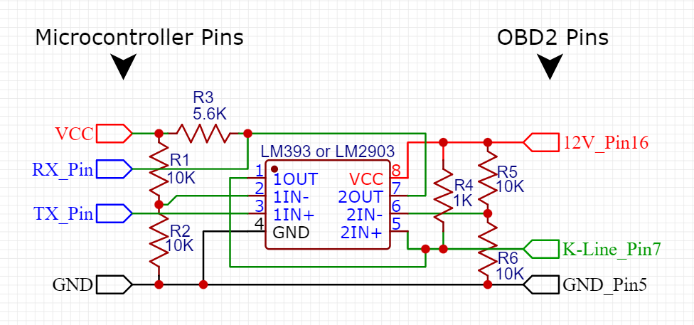

A cheap comparator such as the **LM393** gives a clean digital level with well-defined thresholds. It needs a few more parts than the transistor version but is noticeably more robust.

#### Dedicated automotive transceivers — L9637D, MC33290, Si9241, SN65HVDA195

<p>
  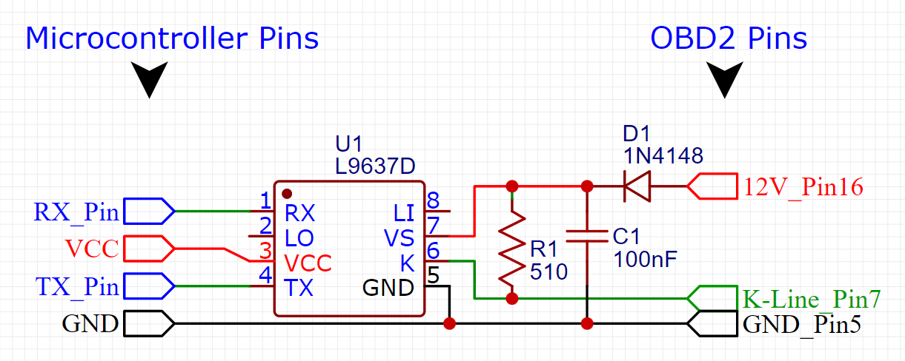
  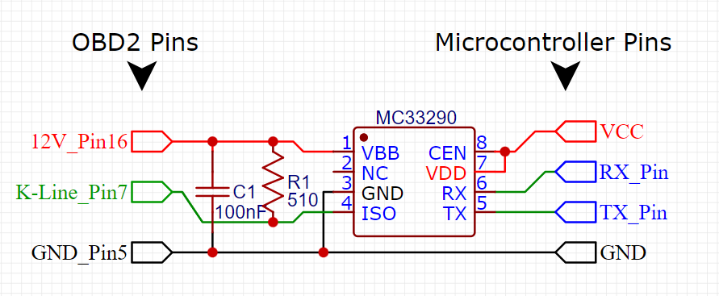
</p>
<p>
  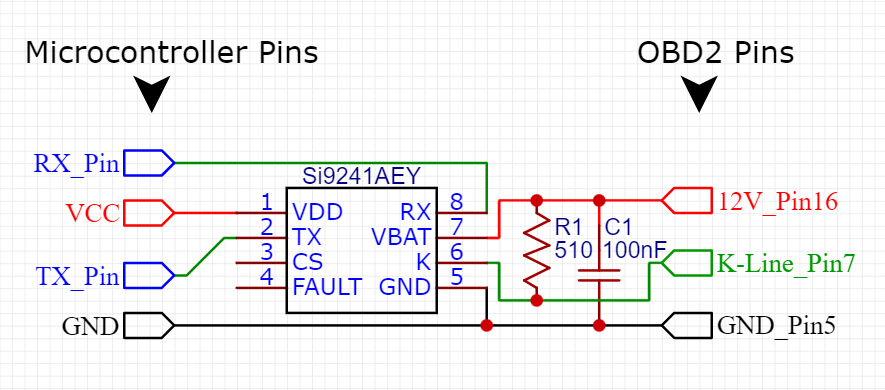
  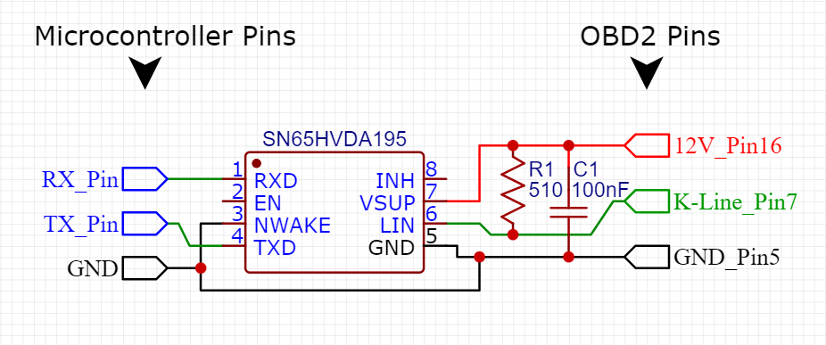
</p>

Purpose-built ISO 9141 transceivers with built-in level shifting and protection. They are standards-compliant and the most reliable choice, which makes them the right pick for permanent and production designs.

### 🧩 Custom PCBs

<p align="center">
  
  
  
</p>

<table>
  <tr>
    <td width="20%" valign="middle">
      <a href="https://pcbway.com/g/SD5aQu"></a>
    </td>
    <td width="80%" valign="middle">
      The custom PCBs in this project were manufactured with sponsorship from <a href="https://pcbway.com/g/SD5aQu"><b>PCBWay</b></a>. Board quality, fast delivery and support were excellent, and I'm grateful for their help. Need boards for your own project? <a href="https://pcbway.com/g/SD5aQu"><b>Check out PCBWay →</b></a>
    </td>
  </tr>
</table>

## 🚀 Quick Start

```bash
git clone https://github.com/muki01/OBD2_K-line_Reader.git
```

1. **Build the interface** using one of the [schematics](#-interface-schematics) and wire it to your board's UART.
2. **Choose a build** and follow its step-by-step guide:
   - 🌐 **[WebServer_Code: setup guide](WebServer_Code/README.md)** (ESP32 / ESP8266 web dashboard)
   - 🖥️ **[Basic_Code: setup guide](Basic_Code/README.md)** (Arduino / ESP32 Serial Monitor)
3. **Plug into the OBD-II port**, turn the ignition **on**, and wait a few seconds for the handshake.
4. **Web build:** join the WiFi network **`OBD2 Master`** (password `12345678`) and open **http://192.168.4.1**.

### Default pins

| Board | K-Line RX | K-Line TX | UART | LED | Buzzer | Battery ADC |
|---|:---:|:---:|:---:|:---:|:---:|:---:|
| ESP32 / ESP32-S3 (WebServer & Basic) | GPIO 10 | GPIO 11 | `Serial1` | GPIO 6 | GPIO 8 *(web)* | GPIO 1 *(web)* |
| ESP8266 (WebServer) | GPIO 3 | GPIO 1 | `Serial` (UART0) | GPIO 2 | GPIO 4 | GPIO 5 |
| Arduino Uno / Nano / Pro Mini (Basic) | D8 | D9 | AltSoftSerial | D13 | none | none |

> [!NOTE]
> GPIO 10 / 11 fit ESP32-S3 / C3 / C6 boards. On a classic ESP32-WROOM they are connected to the SPI flash, so pick other free pins there (for example GPIO 16 / 17) by editing the `#define`s at the top of the sketch.

## 🗂️ Repository Structure

```text
OBD2_K-line_Reader/
├── WebServer_Code/        # ESP32 / ESP8266 firmware with WiFi web dashboard + OTA
│   ├── data/              # Gzipped web UI (upload to SPIFFS)
│   └── README.md          # Setup guide
├── Basic_Code/            # Serial Monitor firmware for Arduino & ESP32
│   └── README.md          # Setup guide
├── Schematics/            # K-Line interface circuits (transistor, LM393, L9637D, MC33290, ...)
└── images/                # Banner, demo GIF and screenshots
```

## ❓ FAQ

<details>
<summary><b>What is K-Line?</b></summary>
<br>
K-Line is a single-wire, bidirectional serial bus on <b>pin 7</b> of the OBD-II connector. It runs at 10.4 kbaud with 12 V logic levels and carries two diagnostic protocols: <b>ISO 9141-2</b> and <b>ISO 14230 (KWP2000)</b>. It was the dominant diagnostic bus on European and Asian vehicles until CAN (ISO 15765-4) replaced it.
</details>

<details>
<summary><b>Which cars are supported?</b></summary>
<br>
Any vehicle whose engine ECU answers generic OBD-II requests over ISO 9141-2 or KWP2000. In practice that is most European and Asian petrol cars from about 2000 to 2010, plus many diesels. Check that pin 7 of your OBD-II socket is populated. Manufacturer-specific protocols such as VAG KW1281 or BMW I/K-Bus are handled in <a href="#-related-projects">related projects</a>.
</details>

<details>
<summary><b>Is this an ELM327 replacement? Does it work with Torque or Car Scanner?</b></summary>
<br>
It replaces the ELM327 <i>for K-Line vehicles</i>, but it does not emulate the ELM327 AT command set, so third-party ELM327 apps won't connect to it. It comes with its own web dashboard (no app needed) and a Serial Monitor build that you can easily extend or integrate.
</details>

<details>
<summary><b>What is the difference between ISO 9141-2 and KWP2000?</b></summary>
<br>
Both run on the same physical K-Line at 10.4 kbaud. ISO 9141-2 always starts with a slow 5-baud init and uses the <code>68 6A F1</code> header. KWP2000 (ISO 14230) supports both slow and <b>fast init</b>, uses length-encoded headers (<code>Cx 33 F1</code>) and adds richer services. Leave the firmware on <code>Automatic</code> and it figures this out for you.
</details>

<details>
<summary><b>Can I clear the check-engine light (MIL)?</b></summary>
<br>
Yes. <b>Clear Error Codes</b> sends OBD-II Mode 04, which clears stored DTCs, freeze-frame data and the MIL. Fix the underlying fault first, or the code will come back.
</details>

<details>
<summary><b>Can I use it with my CAN-bus car?</b></summary>
<br>
Not with this firmware. Use the sister project <a href="https://github.com/muki01/OBD2_CAN_Bus_Reader"><b>OBD2 CAN Bus Reader</b></a>, which shares the same web dashboard.
</details>

## 🤝 Contributing

Contributions are welcome: bug reports, new PIDs, tested vehicle reports, new board ports and documentation fixes. Please read the **[Contributing Guide](CONTRIBUTING.md)** and our **[Code of Conduct](CODE_OF_CONDUCT.md)**.

**Tested it on your car?** Open an issue with the make, model, year and detected protocol. Real-world compatibility reports help everyone.

## 🔗 Related Projects

This firmware is part of a family of open-source automotive projects. They share the same hardware approach, so what you build for one carries over to the others.

<table>
  <tr>
    <th colspan="3" align="left">Firmware — flash it and use it</th>
  </tr>
  <tr>
    <td width="30%"><a href="https://github.com/muki01/BMW_IBus_KBus"><b>BMW I-Bus / K-Bus Firmware</b></a></td>
    <td>Phone control and key-fob light functions for the BMW E46, on the ESP32 and Arduino.</td>
    <td width="118" align="center"><a href="https://github.com/muki01/BMW_IBus_KBus/stargazers"></a></td>
  </tr>
  <tr>
    <td width="30%"><b>OBD2 K-Line Reader</b><br><sub>you are here</sub></td>
    <td>Scan tool for K-Line cars (ISO 9141-2, KWP2000) with a web dashboard, for the ESP32, ESP8266 and Arduino.</td>
    <td width="118" align="center"><a href="https://github.com/muki01/OBD2_K-line_Reader/stargazers"></a></td>
  </tr>
  <tr>
    <td width="30%"><a href="https://github.com/muki01/OBD2_CAN_Bus_Reader"><b>OBD2 CAN Bus Reader</b></a></td>
    <td>Scan tool for CAN bus cars (ISO 15765-4) with the same web dashboard, for the ESP32.</td>
    <td width="118" align="center"><a href="https://github.com/muki01/OBD2_CAN_Bus_Reader/stargazers"></a></td>
  </tr>
  <tr>
    <td width="30%"><a href="https://github.com/muki01/VAG_KW1281"><b>VAG KW1281</b></a></td>
    <td>KW1281 diagnostics for VW, Audi, Škoda and SEAT: ECU information, measuring groups and fault codes.</td>
    <td width="118" align="center"><a href="https://github.com/muki01/VAG_KW1281/stargazers"></a></td>
  </tr>
  <tr>
    <th colspan="3" align="left">Libraries — build your own firmware</th>
  </tr>
  <tr>
    <td width="30%"><a href="https://github.com/muki01/BMW_IBus_KBus_Library"><b>BMW IBus KBus Library</b></a></td>
    <td>Receives, checks and sends BMW I-Bus and K-Bus messages; the library behind the BMW firmware.</td>
    <td width="118" align="center"><a href="https://github.com/muki01/BMW_IBus_KBus_Library/stargazers"></a></td>
  </tr>
  <tr>
    <td width="30%"><a href="https://github.com/muki01/OBD2_KLine_Library"><b>OBD2 K-Line Library</b></a></td>
    <td>K-Line diagnostics behind one API: ISO 9141-2, KWP2000, KW1281, DS2 and KW82.</td>
    <td width="118" align="center"><a href="https://github.com/muki01/OBD2_KLine_Library/stargazers"></a></td>
  </tr>
  <tr>
    <td width="30%"><a href="https://github.com/muki01/OBD2_CAN_Bus_Library"><b>OBD2 CAN Bus Library</b></a></td>
    <td>OBD-II diagnostics over ISO 15765-4 with the ESP32's built-in CAN controller.</td>
    <td width="118" align="center"><a href="https://github.com/muki01/OBD2_CAN_Bus_Library/stargazers"></a></td>
  </tr>
  <tr>
    <th colspan="3" align="left">Interface</th>
  </tr>
  <tr>
    <td width="30%"><a href="https://github.com/muki01/OBD2-Diagnostic-UI"><b>OBD2 Diagnostic UI</b></a></td>
    <td>The web dashboard used by the two OBD2 readers.</td>
    <td width="118" align="center"><a href="https://github.com/muki01/OBD2-Diagnostic-UI/stargazers"></a></td>
  </tr>
</table>

> 💡 **Building your own firmware?** The **[OBD2 K-Line Library](https://github.com/muki01/OBD2_KLine_Library)** wraps the K-Line protocol in a clean Arduino API.

## 💼 Custom Development

I design automotive diagnostic tools, firmware and hardware professionally. Whether you need a complete product or only the communication layer, I can help.

| Service | Details |
| :-- | :-- |
| **Protocol implementation** | BMW I/K-Bus, K-Line (ISO 9141-2 / KWP2000), CAN / UDS, VAG KW1281 and other manufacturer-specific protocols |
| **ECU communication & reverse engineering** | Bus sniffing, packet decoding, module control, undocumented ECUs and buses |
| **ECU security access** | Seed-key algorithms and unlock routines for KWP2000 / UDS |
| **Embedded firmware** | Arduino, ESP32, ESP8266, STM32, Raspberry Pi Pico |
| **Custom hardware** | Diagnostic dongles, shields and PCBs designed to your requirements |
| **Companion apps** | Android, iOS and web apps to visualise, log and control your device |

Have a project in mind? Reach out through the [Contact](#-contact) section below.

## 📬 Contact

For custom development, collaboration, sponsorship or ready-made devices:

| Channel | Address |
| :-- | :-- |
| 📧 **Email** | [muksin.muksin04@gmail.com](mailto:muksin.muksin04@gmail.com) |
| 💼 **LinkedIn** | [linkedin.com/in/muksin-muksin](https://www.linkedin.com/in/muksin-muksin/) |
| 🐙 **GitHub** | [@muki01](https://github.com/muki01) |

## ☕ Support the Project

If this project helped you, consider supporting its development:

<p>
  <a href="https://www.buymeacoffee.com/muki01"></a>
  <a href="https://www.paypal.com/donate/?hosted_button_id=SAAH5GHAH6T72"></a>
  <a href="https://github.com/sponsors/muki01"></a>
</p>

## 📈 Star History

<a href="https://star-history.com/#muki01/OBD2_K-line_Reader&Date">
  <picture>
    <source media="(prefers-color-scheme: dark)" srcset="https://api.star-history.com/svg?repos=muki01/OBD2_K-line_Reader&type=Date&theme=dark">
    
  </picture>
</a>

## ⚠️ Disclaimer

> [!WARNING]
> This is a hobby and educational project provided **as is**, without warranty. Connecting custom hardware to a vehicle carries risk. The author is not responsible for any damage to vehicles, ECUs or equipment. **Never operate the device or look at the dashboard while driving.** Run the acceleration test only on closed roads or private property, in line with local law.

## 📄 License

Released under the **[GNU General Public License v3.0](LICENSE)**.

- You are free to use, study, modify and share this firmware.
- If you distribute it — on its own or as part of a product or firmware — you must make the complete source available under the same license.

**Closed-source or commercial product?** A separate commercial license is available. Get in touch through the [Contact](#-contact) section.

Copyright © 2023–2026 Muksin Muksin.

---

<div align="center">

Created by [**Muki**](https://github.com/muki01) · If this project helped you, please give it a ⭐

<sub>OBD2 · OBD-II · K-Line · KWP2000 · ISO 9141-2 · ISO 14230 · ESP32 · ESP8266 · Arduino · car diagnostics · DTC reader · scan tool</sub>

**[⬆ Back to top](#readme-top)**

</div>
